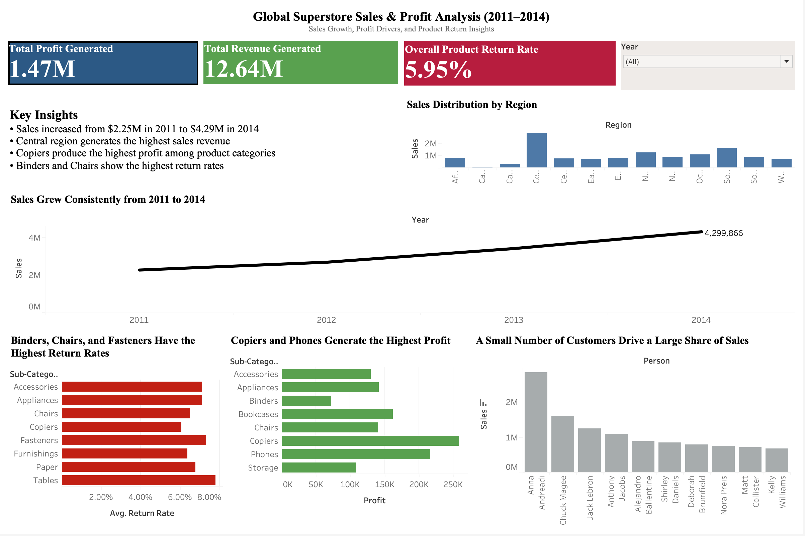

# Global Superstore Sales & Profit Analysis

## Project Overview

This project analyzes the Global Superstore dataset to understand sales performance, profitability drivers, and product return behavior.

The analysis combines Python for data preparation, SQL for business analysis, and Tableau for visualization.

---

## Tools Used

Python (Pandas) – Data cleaning and preprocessing  
SQL (SQLite) – Analytical queries and KPI calculations  
Tableau – Dashboard and visualization  

---

## Skills Demonstrated

- Data Cleaning (Python, Pandas)
- Data Analysis (SQL)
- Data Visualization (Tableau)
- Business Insight Generation
- Dashboard Design

---

## Key Business Questions

- How have sales evolved over time?
- Which regions generate the highest revenue?
- Which product categories drive profit?
- Which products have the highest return rates?
- Which customers contribute the most revenue?

---

## Key Insights

- Sales increased from $2.25M in 2011 to $4.29M in 2014
- The Central region generates the highest sales
- Copiers and Phones generate the highest profits
- Binders and Chairs have the highest return rates
- A small number of customers drive a large portion of revenue

---

## Dashboard 
 

---
### Interactive Dashboard

View the interactive dashboard on Tableau Public:

[Tableau Dashboard Link](https://public.tableau.com/shared/M4HMYFH8S?:display_count=n&:origin=viz_share_link)

---

## Project Structure

```
data/
raw dataset files

notebooks/
data cleaning notebooks

sql/
analysis queries

dashboard/
tableau dashboard image
```

---

## Author

Charitha Vandrasi  
Aspiring Data Analyst
